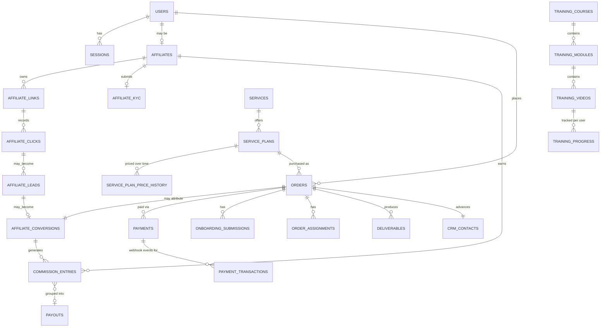

# GrowEazzy — Architecture (Phase 0)

Status: **draft for business sign-off**. This document exists so the decisions
below get made *before* code depends on them, not discovered mid-build.

## 1. What this platform is

GrowEazzy is a single-seller Indian performance marketing platform. It sells
three of its own services and runs a single-level affiliate programme on top.
It is explicitly **not** a marketplace — there is one seller (GrowEazzy
itself), and affiliates refer buyers to GrowEazzy's own services for a
commission. Nobody earns from recruiting other affiliates.

**Services**: Real Estate Qualified Buyers, AI Content Avatar, Unlimited Video
Editing.

**Affiliate programme**: 10% commission (admin-configurable), single-level
only, ₹2,000 registration fee (admin-configurable, switchable off), fortnightly
payouts above a ₹1,000 minimum, TDS deducted.

Market: India. Currency: INR, stored as integer paise. Timezone: IST for all
scheduling and display. Language: English UI, Hinglish support conversations.

## 2. Stack

| Layer | Choice | Why |
|---|---|---|
| Framework | Next.js 16 (App Router), React 19, TypeScript (strict) | Server components + route handlers cover both the public site and the API surface without a separate backend |
| Styling | Tailwind CSS 4 | CSS-first config, no build-time content scanning surprises |
| Database | PostgreSQL 16 | Transactions + partial unique indexes are load-bearing for the commission ledger |
| ORM | **Drizzle**, not Prisma | Prisma's schema engine fetches platform binaries at install time and fails behind restrictive networks; Drizzle is pure TypeScript and its explicit SQL is what the ledger needs |
| Password hashing | Argon2id (m=19456, t=2, p=1) | Current OWASP recommendation |
| Payments | Razorpay (Orders API + Standard Checkout) | INR-native, webhook-driven |
| Validation | Zod at every input boundary | Client input is never trusted, including *which plan* vs *what it costs* |

## 3. The seam that makes Phase 9 not a rewrite

No page or component reads content directly. Everything — service copy,
pricing, training courses — goes through `src/lib/repository.ts`, which
exposes `async` functions from day one (`getServices()`, `getServicePlan(id)`,
...) even while Phase 1 backs them with static data. Phase 9 swaps the
function bodies for database queries. **No page changes.** This is the
single highest-leverage structural decision in the build, so it's built in
Phase 1, not retrofitted.

## 4. Auth model

- Sessions are **database rows**, not JWTs — `sessions` table, only
  `sha256(token)` stored. A suspended user loses access on their *next*
  request, not at token expiry.
- Three independent expiry mechanisms per session: a sliding window (extends
  on activity), an absolute cap (expires regardless of activity), and a
  `sessionsValidFrom` watermark on the user row that invalidates every
  existing session at once on password reset or suspension.
- RBAC is **permissions, not role strings**. 36+ permissions in a catalogue,
  roles are compositions of permissions, and `can(actor, "payout.approve")`
  resolves from the database per request — so access changes are a data
  change, not a deploy.
- **Middleware is not the security boundary.** Next.js middleware runs on the
  edge with no database connection; it may do coarse routing (e.g. redirect
  unauthenticated users away from `/dashboard`), but every page and route
  handler re-checks authorization server-side. Deleting middleware should
  make nothing *more* accessible, only less convenient.
- Account enumeration is closed: unknown email and wrong password return
  byte-identical responses; a resource that isn't yours returns 404, not 403.
- MFA (TOTP, RFC 6238) is enforced in the actor-resolution guard every page
  and API route already passes through, not in the login route — so it
  applies to routes added after this document is forgotten.

## 5. Affiliate lifecycle

```
REGISTERED → KYC_PENDING → KYC_SUBMITTED → (KYC_REJECTED | FEE_PENDING) → ACTIVE → (SUSPENDED | TERMINATED)
```

**KYC happens before the fee is charged.** A rejected KYC after a paid fee
creates a refund obligation and a compliance headache; rejecting first is
strictly safer.

KYC (PAN, bank details) is encrypted at rest with AES-256-GCM. Only the last 4
characters are stored in a readable column for display; a keyed HMAC
fingerprint of the full value lets the system detect duplicate identities
without ever decrypting stored data for that check.

Payment collection goes through a `PaymentGateway` interface. Phase 3 ships a
`MockPaymentGateway`; the Razorpay adapter (Phase 5) implements the same
interface, so nothing above the interface changes when the real gateway lands.

## 6. Attribution & commission engine

Each service has its own referral link shape: `/ai-content-avatar?ref=GEA10245`
must work from any public URL, not just a dedicated landing page. Flow:

1. Next.js middleware detects `?ref=` on any request.
2. It hands off to a Node route handler (middleware itself cannot write to
   Postgres) which records the click and sets a signed, httpOnly cookie.
3. The route **redirects to the same URL with `ref` stripped**, so a page
   refresh is not a second click and a copy-pasted/shared URL doesn't
   re-attribute to whoever shares it next.

Commission entries move through:

```
PENDING → APPROVED → AVAILABLE → PAID
                                → REVERSED (money was earned, then clawed back)
PENDING → CANCELLED (order never completed — nothing was earned)
```

**CANCELLED and REVERSED are not the same state under a different name.**
Cancelled: the underlying order never completed, so no earning ever existed —
no negative ledger row is written, because there is nothing to reverse.
Reversed: a payment was captured, a commission was earned, and it is now being
clawed back (e.g. a later refund) — both the original earning row and the
reversal row stay in the ledger permanently. Deleting or editing the original
row on reversal is exactly the mistake §9 of the build notes warns about.

**Partial refunds reverse a proportional share of the commission**, not the
whole thing, and the proportion is computed from Razorpay's own cumulative
`amount_refunded` on the payment — not a locally incremented counter, which
drifts permanently the first time a webhook delivery is missed.

### The ledger itself

- **Append-only.** No mutable balance column anywhere. An earning is a
  positive `commission_entries` row; a reversal or refund adjustment is a
  *new* negative row referencing the same conversion. The original row is
  never edited or deleted.
- Balance for any affiliate, at any point in time, is `SUM(amount_paise)`
  over their rows — computed on read, not maintained incrementally.
- **"One earning per conversion" is a database constraint**, not an
  application-level check:
  ```sql
  CREATE UNIQUE INDEX commission_one_earning_per_conversion_uidx
    ON commission_entries (conversion_id) WHERE type = 'EARNING';
  ```
  Application code racing under concurrent load is exactly the condition
  this exists to survive.

## 7. Payment flow

Razorpay Orders API for collection (never Route/split settlement — see
decision D-1 below), Standard Checkout in the browser, all amounts in integer
paise end to end.

- A payment is marked successful **only** by a signature-verified webhook or a
  server-to-server status fetch. The frontend's `payment.success` callback is
  a hint to poll, never a source of truth.
- Webhook signatures are verified over the **raw request body** — Next.js
  route handlers must read the raw bytes before any JSON parsing touches them,
  since re-serialized JSON does not reproduce the same digest.
- The webhook secret and the API key secret are separate values from separate
  Razorpay dashboard pages; a config that conflates them makes every webhook
  fail closed (i.e., safe, but confusing to debug — call this out in setup
  docs so it isn't mistaken for a real outage).
- Every webhook delivery is idempotent via a uniquely-indexed `webhook_events`
  inbox keyed on the provider's event id. A replayed delivery is a no-op, not
  a re-processed event.
- A payment created without an `order_id` cannot be captured server-side and
  is auto-refunded by Razorpay — so an order row is always created before
  checkout opens, never after.
- `PAYMENT_MODE` (`test`/`live`) has no default and is cross-checked against
  the Razorpay key prefix at boot (`rzp_test_...` vs `rzp_live_...`); a
  mismatch refuses to boot rather than silently taking real payments in test
  mode or vice versa.

## 8. Client workflow

```
Service → checkout → payment → verification → order → CRM contact →
onboarding → meeting → requirements locked → team assigned → work →
review → delivery → completion
```

Each service has its own onboarding form with two Zod schemas over the same
JSON shape: a **draft schema** (everything optional, so "save and come back"
works mid-form) and a **submit schema** (the real, complete requirements).
Both are validated in exactly one shared module — duplicating the shape
invites drift between what's enforced and what's stored.

Submitting the brief does **not** lock requirements — the kick-off call
happens between submission and locking, and there is no transition back from
`requirements locked` to an editable state (a locked brief that needs to
change becomes a new, explicit change request, not a silent edit).

## 9. CRM

```
NEW → CONTACTED → QUALIFIED → ONBOARDING → IN_PROGRESS → REVIEW → DELIVERED → COMPLETED
```
Plus `LOST` and `CANCELLED` as terminal states reachable from most of the
above.

**The CRM fills itself from the workflow — it is not a separate system
someone has to remember to update.** Buying a service creates/advances a
contact; every delivery-stage transition moves it. Contacts are de-duplicated
on email, and the user account is resolved by email even when no `userId` is
supplied on order creation — otherwise a contact can show zero orders while
the actual work sits one join away, undiscoverable from the CRM screen.

## 10. Training portal

10 courses → modules → lessons (videos). Draft content is **absent from every
query a learner's screen can see**, not merely hidden by a UI flag — a lesson
cannot be published before its parent module and course are. Progress per
lesson is monotonic (`GREATEST(new_progress, old_progress)`, never
regresses), sticky once marked complete, and clamped to the lesson's actual
duration. A lesson completes at 90% watched, not 100% — video players
routinely under-report the final second or two.

## 11. Admin dashboard

Phase 9 moves the service catalogue (from the Phase 1 repository seam) into
the database. `service.edit` (copy, images, FAQ) and `service.pricing`
(amounts, plans) are **separate permissions** — someone trusted to fix a typo
in a tagline is not thereby trusted to reprice the catalogue.

Every price change requires a reason and writes a `service_plan_price_history`
row in the same transaction as the price update — so "what did this cost on
the day this specific order was placed" is always answerable, and existing
orders are never retroactively repriced (orders store their own amount at
purchase time regardless of what the catalogue says later).

Revenue metrics count only `CAPTURED` payments with refunds subtracted, and
**nothing is cached** — every admin-facing number is summed from source rows
on read. A cached number that is wrong looks exactly like a correct one.

## 12. Commission scheduler

`releaseMaturedCommissions` does not release everything past its hold date —
it re-verifies from source per entry: conversion status, affiliate status,
order stage, payment status, the refund window, and that no payout already
claims the entry. Each entry is processed in its own transaction with
`SELECT ... FOR UPDATE` and a repeated `WHERE` clause, so a refund landing
mid-run makes that entry's release a no-op instead of a race.

Reversal failures during the run are **logged, not thrown** — a CRM hiccup
during reversal must never roll back an otherwise-successful release/payout of
unrelated entries. The corollary: a refunded payment whose reversal failed
sits at `PENDING` and gets swept up on the *next* scheduled run, so reversal
failures need their own alerting, not just log lines nobody reads.

The scheduler's advisory lock is taken on a **dedicated connection**, not
borrowed from the pool — Postgres advisory locks are session-scoped and
re-entrant, so a pooled connection can hand the "same" lock to a second
concurrent run and let it sail through. That isn't a rare edge case in a
pooled environment; it is the default behavior of `pg_advisory_lock` used
against a pool.

The endpoint is authenticated with a constant-time comparison against
`CRON_SECRET`; with no secret configured it returns 503 rather than running
unauthenticated.

## 13. Explicit decisions the business must make before/during Phase 0

| # | Decision | Default this build assumes | Why it matters |
|---|---|---|---|
| D-1 | Razorpay Route (split settlement) vs. collect-and-disburse separately | **Do not use Route.** Collect full amount, hold it, disburse via RazorpayX/Cashfree Payouts | Route splits at capture time — incompatible with hold periods, refund reversals, manual payout approval, and batched TDS-net payouts |
| D-2 | ₹2,000 affiliate registration fee — keep, reduce, or remove | Kept, but **admin-configurable and switchable to ₹0** | Largest compliance risk in the whole product — see §14 |
| D-3 | Commission rate | 10%, admin-configurable | Needs to be changeable without a deploy for pricing experiments |
| D-4 | Payout cadence & minimum | Fortnightly, ₹1,000 minimum | Affects affiliate cash flow and support volume around payout dates |
| D-5 | TDS rate & threshold | Not hardcoded — configurable per current Income Tax rules | Tax rates change; hardcoding invites a future silent compliance miss |
| D-6 | Who can approve payouts vs. who can edit service pricing | Separate permissions (`payout.approve`, `service.pricing`) | A shared "admin" role is a bigger blast radius than the business likely intends |
| D-7 | Cooling-off period length for affiliate registration | Not yet set — **legal input required**, see §14 | Directly mitigates D-2's risk |
| D-8 | Named grievance officer for affiliate disputes | Not yet assigned | Required groundwork regardless of the fee's legal status |
| D-9 | GST registration/treatment for commission payouts and the registration fee | Not yet determined — **accountant input required** | Affects invoicing fields the schema needs to carry (GSTIN, HSN/SAC, etc.) |
| D-10 | File/video storage: local disk vs. S3 for Phase 8 training videos and Phase 6 deliverables | S3-shaped interface (`STORAGE_DRIVER=local\|s3`) from day one, local for dev | Avoids a rewrite when moving off a single server |

## 14. Compliance — flagged, not concluded

**This section is not legal advice and settles nothing on its own.** The user
has indicated legal/CA review is already underway for this platform; the
items below are exactly what should be in front of that review, listed so
nothing here is discovered only after launch.

- **The ₹2,000 affiliate registration fee is the largest non-technical risk
  in this product.** The Consumer Protection (Direct Selling) Rules, 2021
  restrict entry fees charged to direct sellers, and the Prize Chits and
  Money Circulation Schemes (Banning) Act, 1978 criminalizes pay-to-join
  structures where return depends on recruiting others. This programme is
  single-level (no recruitment override) and the fee is framed against
  training delivered, which are the right structural mitigations to *discuss*
  with counsel — they are not a substitute for counsel's sign-off.
- Mitigations this build implements regardless of the fee's ultimate legal
  treatment: the fee is admin-configurable and can be switched to ₹0 entirely
  without a deploy; the programme is single-level only, enforced in the
  commission engine itself (there is no code path that pays an affiliate for
  another affiliate's recruitment); real training content is delivered for
  the fee (Phase 8); a cooling-off period, versioned/dated terms-of-service
  records, and a named grievance officer are schema-supported (D-7, D-8) even
  before the exact period/officer are decided.
- Also flagged for the same review, not resolved here: the 10% commission
  model's characterization for tax purposes, the refund policy's enforceability
  as drafted, affiliate terms generally, payout terms and TDS deduction
  mechanics, KYC/PII retention periods under Indian data protection law, GST
  treatment (D-9), the specific wording of real-estate lead/buyer-qualification
  claims (advertising/RERA-adjacent risk), customer service terms, and general
  privacy obligations for PII collected (KYC documents, contact details).

## 15. Known gaps, shipped consciously

Carried forward from the build brief, not accidents to be "discovered" later:

- Rate limiting is in-memory in this build — fine for a single instance,
  useless across multiple; needs Redis before horizontal scaling.
- CSP still allows `'unsafe-inline'` for scripts because Next's own bootstrap
  script needs it without a nonce-based CSP wired through `next.config`.
- No virus scanning on uploads — files sit at `scanStatus: PENDING`
  indefinitely until that's wired to a scanning service.
- No CSRF token layer — `SameSite=Lax` cookies plus requiring JSON
  `Content-Type` on state-changing requests is one layer, not two.
- `PII_ENCRYPTION_KEY` is not rotatable in this build; there is no
  re-encryption tooling yet. Rotating it without that tooling makes existing
  KYC records unreadable.
- Tailwind 4 targets Safari 16.4+; on macOS 12 and older the page renders
  unstyled. Decide whether that matters for the target audience before
  launch.

## 16. High-level ERD



See `src/db/schema/` for the full 47-table Drizzle schema and
`drizzle/manual/*.sql` for the hand-written constraints Drizzle's DSL cannot
express (partial unique indexes, CHECK constraints).

## 17. API surface (by phase)

Full route list lives alongside each phase's code as it's built. At a glance:

- **Public** (Phase 1): service pages, `/api/contact`, `/[service]?ref=...`
  attribution redirect
- **Auth** (Phase 2): `/api/auth/{register,login,logout,session,mfa/*}`
- **Affiliate** (Phase 3): `/api/affiliate/{register,kyc,fee-payment,links,dashboard}`
- **Client** (Phase 6): `/api/checkout`, `/api/orders/*`, `/api/onboarding/*`
- **Payments** (Phase 5): `/api/payments/webhook` (Razorpay), `/api/payments/verify`
- **CRM/Admin** (Phase 7, 9): `/api/admin/*` behind permission checks, not role checks
- **Training** (Phase 8): `/api/training/*`, `/api/progress`
- **Ops**: `/api/health`, `/api/ready` (Phase 0); `/api/cron/release-commissions`
  (Phase 12, §29)

## 18. Next steps

Phase 0 sign-off needs answers to D-1 through D-10 (§13) — none of them block
starting Phase 1's static pages, but D-1, D-2, D-3 and D-5 shape the schema
Phase 4 builds on, so they should land before Phase 3 starts in earnest.

Build order from here follows the phases in the project brief: Phase 1
(public site + repository seam), Phase 2 (auth & RBAC), Phase 3 (affiliate
system) — all done, see §19-§20 — then Phase 4 (attribution & commission)
next.

## 19. Phase 2 notes: two real mistakes caught before they shipped

In the spirit of §9's "mistakes this build actually made" — these were
caught during Phase 2, not hypothetical:

1. **`src/db/index.ts` eagerly called the full `getEnv()`** just to read
   `DATABASE_URL`/`DATABASE_SSL`, so any standalone script importing `db`
   (the roles/permissions seed, in this case) failed validation for
   Razorpay keys, session secret, etc. it had no reason to need. Fixed by
   having the db module read those two vars directly from `process.env`,
   and moving the actual "refuse to boot on bad config" enforcement to
   `src/instrumentation.ts`'s `register()` hook, which Next.js runs once at
   real server boot. `drizzle.config.ts` already followed this narrower
   pattern; `src/db/index.ts` now matches it.
2. **Confirmed, against a real Postgres instance, that Drizzle's
   node-postgres driver puts the actual pg error (with `.code` and
   `.constraint`) at `err.cause`, not on `err.message`** — checking
   `err.message.includes('duplicate key')`, this build's first instinct,
   never fires (`err.message` is just `"Failed query: <sql>"`). This is
   verbatim mistake #4 from §9 of the original brief; `src/lib/db-errors.ts`
   (`isUniqueViolation`) exists specifically so this check is written once,
   correctly, and reused everywhere a unique-index violation needs to
   become a clean error response.

Both are covered by regression tests (`tests/db-errors.test.ts`; the seed
script running successfully with only `DATABASE_URL` set is exercised by
`npm run db:seed:roles` in the getting-started flow) so they can't silently
reappear.

## 20. Phase 3 notes

Phase 3 (affiliate lifecycle, encrypted KYC, the `PaymentGateway` interface
and its `MockPaymentGateway`, and the registration fee flow) deliberately
built `activateFromVerifiedPayment` (`src/lib/affiliate/fee.ts`) to *re-read
the payment row from the database and check its status, purpose, and
affiliate linkage itself* before activating anything — this is verbatim
mistake #7 from §9 of the original brief ("`activateFromVerifiedPayment`
never read the payment row — it trusted the id despite its name"), and it
was written defensively from the start rather than caught after the fact.
`tests/affiliate-fee.test.ts` has a test named for exactly this: confirming
a payment the mock gateway reports as `failed` must not activate the
affiliate no matter how confirm is called — if the guard is ever removed,
that test fails immediately.

Two schema-level things worth calling out, neither a bug so much as a
deliberate choice that test cleanup had to respect: `payments.affiliate_id`
and `affiliate_kyc.reviewed_by_user_id` are plain foreign keys, not
`ON DELETE CASCADE` — a payment or a KYC review decision is a financial/audit
record that must survive even if the account referencing it is later
removed. `tests/helpers.ts`'s `deleteTestUser` unwinds these explicitly
(delete the affiliate's payments, null out any KYC rows this user reviewed,
then delete the user) rather than relying on cascade, which is exactly what
a real "close this account" admin action would also have to do.

Also new in this phase: `src/lib/crypto/pii.ts` derives two independent
subkeys (encryption, HMAC fingerprinting) from the single
`PII_ENCRYPTION_KEY` via HKDF with a fixed, empty salt — deliberately
deterministic (the same master key must always yield the same subkeys, or
existing encrypted KYC data becomes unreadable), which is the opposite of
HKDF's usual randomized-salt use case. Tested directly in `tests/pii.test.ts`,
including that a tampered ciphertext fails GCM's auth tag check rather than
silently decrypting to garbage.

### A real infrastructure mistake this build made, found and fixed live

The first version of the HTTP-level test suite had `tests/auth-routes.test.ts`
and `tests/affiliate-routes.test.ts` each spawn their own `next dev` server
on a different port in their own `beforeAll`. Running both together
deadlocked the entire suite: **Next.js 16 refuses to run a second `next dev`
against the same project directory at all**, regardless of port — it
detects an existing instance via a `.next/dev/lock` file and either hands
back the running one or hangs waiting on the lock. The symptom looked
exactly like a real bug (tests timing out, a `next-server` process pinned
at 80%+ CPU indefinitely) with no error surfaced until the *other* file's
server startup finally logged `Another next dev server is already running`.

Fixed by not doing that: `tests/global-setup.ts` builds the app once and
starts a **single shared server** (`next start`, not `next dev` — no
dev-mode file-watcher lock, and no lazy per-route compilation, so it's also
faster) for the entire test run via Vitest's `globalSetup`, torn down once
at the end. Every HTTP-level test file now points at that one server
instead of spawning its own. This dropped the HTTP suites from
multi-second-per-test (cold dev-mode compilation) to ~500ms for 9 tests
combined, and eliminated the deadlock entirely — a good reminder that a
"real running server" requirement doesn't mean *one per test file*.

## 21. Phase 4: Attribution & Commission

Referral links work on any public URL (`/[slug]?ref=GEA10245`, but really
any path — middleware checks every request). Middleware detects `?ref=`
and hands off to `/api/attribution/click`, a Node route that looks up the
affiliate, records the click, sets a signed (HMAC, not encrypted — the
cookieId isn't secret) cookie, and redirects to the same URL with `ref`
stripped — the actual mechanism behind "a refresh isn't a second click and
a shared link doesn't re-attribute" from docs/ARCHITECTURE.md §6: the clean
post-redirect URL simply carries no `ref` param to act on.

`affiliateLinks.serviceId` is always `null` for now (site-wide links only):
that column is a real FK into `services`, but the Phase 1 repository seam's
catalogue (`src/lib/repository.ts`) is still static data, not real DB rows
until Phase 9. Nothing about attribution or commission correctness actually
needs a per-service link — commission attaches to the order/conversion, not
the service — so this is a safe simplification, not a shortcut that will
need re-architecting later.

**The commission engine** (`src/lib/attribution/commission.ts`) implements
the CANCELLED/REVERSED distinction from §6 precisely: `recordConversion`
creates a PENDING EARNING entry with the commission rate locked in at
creation time (a later policy change never retroactively changes what a
past conversion earned). `cancelConversionCommission` only ever transitions
that same still-PENDING row to CANCELLED — no new row, because nothing was
ever real money. `reverseConversionCommission` is for the opposite case (a
completed, captured-payment order later refunded): it never touches the
original EARNING row, only inserts a new negative REVERSAL row, and — this
is the part the original brief's mistake #8 got wrong ("partial refunds
reversed the entire commission") — computes a **proportional** share from
the refund amount, and does so **idempotently**: it reads what's already
been reversed for a conversion from the ledger itself (summed from existing
REVERSAL rows, not a separately maintained counter) and only inserts the
delta, so a replayed webhook or a second larger partial refund both just
work without double-reversing. All of this is tested directly in
`tests/attribution-commission.test.ts`, including the idempotent-replay and
delta-on-second-refund cases.

### Two more real infrastructure mistakes, found live in this phase

1. **A leftover shared test server silently poisoned the next run.**
   `tests/global-setup.ts`'s teardown called `server.kill('SIGTERM')` on a
   process spawned via `spawn('npx', ['next', 'start', ...])` — but `npx`
   spawns `next` as its own child and doesn't reliably forward signals to
   it, so the actual `next-server` process survived as an orphan after
   every single test run, still bound to port 3900. The *next* run's
   `isPortInUse`-free version at the time just polled `/api/health` until
   it got a 200 — which the stale leftover server answered immediately,
   so the suite proceeded to test against a build/env from a previous run
   without any indication it wasn't testing its own. This surfaced as a
   `verifyAttributionCookie` returning `null` on a cookie that had just
   been set — looking exactly like a real signing bug — until checking
   `ps aux` mid-investigation showed a `next-server` process from several
   minutes earlier still alive and still listening. Fixed two ways: (a)
   spawn the local `node_modules/.bin/next` binary directly instead of
   through `npx`, so the handle this file holds IS the server process and
   signals actually reach it; (b) `global-setup.ts` now checks whether
   `TEST_SERVER_PORT` is already in use *before* starting anything and
   throws immediately with an explicit "kill the leftover process" message
   instead of silently reusing whatever answers there.
2. **Two test processes need the exact same secret, and that's easy to
   get wrong by accident.** `tests/setup.ts` (the vitest process, used by
   direct library calls) and `tests/global-setup.ts` (the separately
   spawned server process, used by HTTP-level calls) each set their own
   `SESSION_SECRET`/`PII_ENCRYPTION_KEY`/`CRON_SECRET` defaults — and nothing
   forced them to be the same literal string. A test that signs something in
   one process (an HTTP request handled by the server) and verifies it in
   the other (a direct call to `verifyAttributionCookie` from the test file)
   silently fails the moment those values merely differ from each other,
   with no error indicating *why*. Fixed by extracting them into
   `tests/test-env-constants.ts`, imported by both files — one source of
   truth for values that must be byte-identical across two OS processes.

## 22. Phase 5: Razorpay

`RazorpayGateway` (`src/lib/payments/razorpay-gateway.ts`) implements the
same `PaymentGateway` interface `MockPaymentGateway` has satisfied since
Phase 3 — `createOrder`/`fetchPaymentStatus` over Razorpay's REST API with
Basic Auth, nothing above the interface changed. `getPaymentGateway()`
(`src/lib/payments/index.ts`) picks between the two based on
`PAYMENT_PROVIDER`, which is how `src/lib/affiliate/fee.ts`'s fee flow gets
Razorpay for free without any of its own code changing.

**This adapter and the webhook handler have not been exercised against a
real Razorpay account** — this build environment has no network path to
`api.razorpay.com`. `tests/razorpay-gateway.test.ts` tests it only against
a contract fake (a mocked `fetch` returning the request/response shapes
Razorpay's published API reference documents), and the webhook tests use
synthetic, hand-constructed payloads following the same documented shapes.
Treat exact field names (`amount_refunded`, the webhook's event-id
location, etc.) as best-effort until Phase 13 ("real gateway
verification... on a machine that can reach the provider") actually
confirms them — that phase exists specifically to catch the gap between
"matches the docs" and "matches what the live API actually sends."

**Webhook handling** (`src/app/api/webhooks/razorpay/route.ts`):
- Signature verified over the untouched raw body (`request.text()`, never
  parsed before verifying — rule 7) via HMAC-SHA256 keyed on
  `RAZORPAY_WEBHOOK_SECRET` (`src/lib/payments/webhook-signature.ts`),
  constant-time compared.
- **Idempotent inbox with a real retry story, not just replay protection.**
  A webhook row is inserted with `processedAt: null` before any processing
  starts. A delivery whose row already has `processedAt` set is a true
  replay — 200, no-op (rule 9). A delivery whose row exists but
  `processedAt` is still `null` means a *previous attempt at this exact
  event* crashed or errored mid-processing — this is deliberately
  reprocessed rather than treated as "already handled," because every
  handler downstream is itself idempotent (`verifyAndRecordPaymentStatus`
  re-records the same status; `reverseConversionCommission` computes its
  delta fresh from the ledger; re-activating an already-`ACTIVE` affiliate
  is a no-op transition). A processing error leaves `processedAt` null and
  returns 500 so Razorpay's own retry (or a manual replay) tries again,
  rather than silently swallowing a failure as a false "handled."
- `verifyAndRecordPaymentStatus` (`src/lib/payments/confirm.ts`) is
  extracted out of what was Phase 3's `confirmAffiliateFeePayment` so the
  webhook and the manual `/api/affiliate/fee/confirm` flow share the exact
  same "ask the gateway, don't trust the payload" logic — the webhook calls
  `confirmAffiliateFeePayment` directly for `AFFILIATE_FEE` payments (one
  more, harmless idempotent gateway read) and a new, parallel
  `handleServiceOrderPaymentCaptured`/`handleServiceOrderPaymentRefund`
  (`src/lib/payments/order-webhooks.ts`) for `SERVICE_ORDER` ones: mark the
  order `PAID` (only from `AWAITING_PAYMENT`, never regressing a stage a
  fuller Phase 6 state machine has already moved past) and approve the
  PENDING commission entry riding on it — a payment actually capturing is
  what turns a tentative commission into one backed by real money.
- `refund.processed` always re-fetches the payment's status from the
  gateway rather than trusting whatever refund amount is in the webhook
  payload, specifically so `reverseConversionCommission`'s cumulative-not-
  incremental contract (§6, §21) holds no matter what shape a specific
  refund event's payload turns out to have.

D-1 from §13 (no Razorpay Route/split settlement — collect and disburse
separately) is upheld by construction here: nothing in this phase creates
a linked account or splits a payment at capture time; `createOrder` only
ever creates a plain order for the full amount.

## 23. Phase 6: Client workflow

Builds the real version of §8's chain end to end:

```
Service → checkout → payment → verification → order → CRM contact →
onboarding → meeting → requirements locked → team assigned → work →
review → delivery → completion
```

**Catalogue bridge, not a Phase 9 jump.** `orders.service_plan_id` needs a
real `service_plans` row to reference, but the catalogue itself is still
Phase 1's static `src/lib/repository.ts` — Phase 9 is what formally moves
it into the database. `scripts/seed/catalogue.ts` (core logic in
`seedCatalogueFromRepository`, `src/lib/catalogue.ts`, same split as
`db:seed:roles`/`seedRolesAndPermissions`) upserts a real `services`/
`service_plans` row per static entry, keyed on `slug` and a new
`service_plans_service_name_uidx` unique index on `(service_id, name)` —
the only schema change this phase needed. `resolveServicePlan(staticPlanId)`
looks a static plan id (e.g. `"aca-standard"`) up by that `(service slug,
plan name)` pair to find its real row — never by array position or a
freshly-generated id, neither of which survives a reseed. Price is
re-synced from `repository.ts` on every seed run, so pre-Phase-9 a price
change there and a redeploy is still all it takes.

**Checkout → payment → verification** (`src/lib/orders/checkout.ts`,
`POST /api/orders/checkout`, `POST /api/orders/[id]/confirm`) follows
Phase 3's affiliate-fee shape exactly: an order (`AWAITING_PAYMENT`) and its
payment row are created before any client checkout opens, price is read
server-side via `resolveServicePlan` (rule 4, the client sends only a plan
id), and confirmation calls the same `verifyAndRecordPaymentStatus` the
Razorpay webhook uses — a server-to-server gateway fetch, never the
request body's word for it (rule 6). Attribution is resolved and
`recordConversion`-ed at checkout time, same call site the function's own
Phase 4 doc comment named in advance.

**Order → CRM contact, done inside payment capture, not as a separate
step.** `handleServiceOrderPaymentCaptured` (`src/lib/payments/order-webhooks.ts`,
shared by the webhook and the manual confirm route) now does three things
instead of one, all only from `AWAITING_PAYMENT` so a replay is a no-op on
all three: transitions `PAID`, transitions straight on into `ONBOARDING`
(there is no manual step between a captured payment and the client seeing
their onboarding form), and calls `upsertContactForOrder`
(`src/lib/crm/contacts.ts`) — deduped by email, backfilling `userId` onto a
contact that predates the account (e.g. a lead-form row). Full CRM
self-population from every LATER stage transition, plus the dashboard/task
tooling around it (§9), stays Phase 7's job on purpose — this phase's CRM
footprint stops at "the contact exists and this order is on its timeline."

**Onboarding: one shared Zod module, two schemas, never a duplicated
shape.** `src/lib/onboarding-schemas.ts` defines each service's field set
once and derives both a `submit` schema (`z.object(fields).strict()`) and a
`draft` schema (the same object, `.partial()`) from it — a second,
independently-maintained "what's actually required" shape is exactly how a
draft and a submission drift apart. The module has no server-only imports,
so `src/components/OrderWorkspace.tsx` renders each service's form
straight from the same field list (as presentation metadata,
`getOnboardingFieldSpecs` — never used for validation, which stays
server-side only). `saveOnboardingDraft`/`submitOnboarding`
(`src/lib/orders/onboarding.ts`) both refuse to write once
`orders.requirements_locked_at` is set, and — the rule stated explicitly in
the brief — **submitting does not lock requirements**; the kickoff call
still happens in between, and a client can submit again after that call
surfaces a correction, right up until an explicit lock.

**Meeting scheduling and the lock are staff actions on existing
permissions** — `meeting.schedule` and `order.update_stage`, both already
in STAFF's default role since Phase 2, nothing new added to the
catalogue. `scheduleMeeting` (`src/lib/orders/meetings.ts`) only advances
`ONBOARDING → MEETING_SCHEDULED` the first time; a second meeting on an
order already past that stage is just another row, not a repeated
lifecycle event. `lockRequirements` (`src/lib/orders/lock.ts`) is the
explicit, one-way action the brief calls out by name — it refuses to lock a
submission that's still only a draft (`OnboardingNotSubmittedError`), and
there being no transition back out of `REQUIREMENTS_LOCKED` is enforced by
`transitionOrderStage`'s own `ALLOWED_TRANSITIONS` map (§5's pattern,
reused verbatim as `src/lib/orders/lifecycle.ts`), not repeated here.

**Cancel is intentionally narrow about commission.** `POST
/api/orders/[id]/cancel` (owner, or staff with `order.cancel`) transitions
to `CANCELLED` from any non-terminal stage, but only calls
`cancelConversionCommission` when the order was still `AWAITING_PAYMENT` —
past that point, payment capture has already moved the riding commission
entry to `APPROVED`, and `cancelConversionCommission` only ever touches a
`PENDING` one (§6). Cancelling an order that already collected payment does
not silently erase that commission; unwinding it, if it's ever unwound,
goes through the same refund webhook path (`reverseConversionCommission`)
as any other refund — CANCELLED and REVERSED stay the two different ideas
§6 already established, not two names for the same code path.

**Real Razorpay Checkout.js (the customer-facing widget) is deferred
alongside Phase 13**, for the same reason the server-side adapter is: this
sandbox has no network path to `checkout.razorpay.com` any more than
`api.razorpay.com`. Until then, `src/components/CheckoutFlow.tsx` drives
the same `PAYMENT_PROVIDER=mock` dev-simulation endpoint
(`/api/dev/mock-payment`) the affiliate fee flow already uses — swapping in
the real widget is a frontend-only change; none of the server-side
checkout/confirm plumbing behind it moves.

**Three real bugs caught by the test suite before anything shipped on
them**, same discipline as §19-§22:
1. `upsertContactForOrder`'s userId-backfill branch updated the database
   row but returned the stale in-memory `contact` object (still
   `userId: null`) — caught by
   `tests/crm-contacts.test.ts`'s backfill test, fixed by capturing
   `.returning()`'s result instead of assuming the update mutated the
   local variable.
2. `tests/helpers.ts`'s `deleteTestUser` didn't know about two new
   plain (non-cascading) FKs this phase's tables added referencing
   `users.id` by actor — `meetings.scheduled_by_user_id` and
   `order_events.actor_user_id`. A STAFF fixture that scheduled a meeting
   or locked requirements on a DIFFERENT test user's order left rows
   pointing at itself, and deleting that staff user failed with a foreign
   key violation on cleanup — not a bug in the app, but exactly the kind of
   test-harness gap this phase's own `tests/order-routes.test.ts` was
   the first to actually exercise (same shape as the `affiliate_kyc.reviewed_by_user_id`
   gap found in Phase 2/3). Fixed by nulling both columns before deleting
   the user, same pattern as the existing KYC-reviewer case.
3. Extending payment capture to auto-advance `PAID → ONBOARDING` broke an
   existing Phase 5 webhook test's assertion that the order stayed at
   `PAID` — not a regression so much as that test encoding a stage value
   that stopped being the final word the moment this phase's chain landed.
   Updated the assertion (and added CRM-contact coverage to the same test)
   rather than treating it as a false alarm to silence.

## 24. Phase 7: CRM

Builds the rest of §9's promise — **"the CRM fills itself from the
workflow, it is not a separate system someone has to remember to
update"** — as infrastructure, not a per-endpoint habit.

**The sync lives inside the state machine, not at each call site.**
Phase 6's `upsertContactForOrder` (one call, wired into the one place an
order became `PAID → ONBOARDING`) is retired in favour of
`syncContactFromOrderStage` (`src/lib/crm/sync.ts`), called from INSIDE
`transitionOrderStage` itself (`src/lib/orders/lifecycle.ts`), inside the
same transaction as the stage update and the `order_events` insert. This
means every legal order transition — from a webhook, a checkout confirm,
staff scheduling a meeting, locking requirements, or this phase's own new
generic advance endpoint (below) — self-populates the CRM automatically,
including transitions no code written yet even knows about. Nothing above
`transitionOrderStage` had to change to get this; that was the point of
putting it there instead of duplicating a call at every site that
transitions an order.

`ORDER_STAGE_TO_CRM_STAGE` collapses `MEETING_SCHEDULED` and
`REQUIREMENTS_LOCKED` into the same `ONBOARDING` bucket the CRM pipeline
also uses for pure `ONBOARDING` — a sales/ops screen doesn't need a finer
distinction than "getting the client set up" for those three. Contact
creation, email-dedup, and `userId`-backfill onto a pre-existing
lead-form-only contact are unchanged in behaviour from Phase 6, just moved.
`AWAITING_PAYMENT` and `PAID` still have no CRM stage of their own — a
contact only exists once someone is actually onboarding, matching the old
behaviour of creating it at the `ONBOARDING` transition, not at checkout.

**Known, documented simplification, not silently swept under the rug:** a
contact's stage is "whichever order touched it most recently," not an
aggregate across every order a buyer has placed. For a single-seller
business where one contact normally has one active order at a time this
is the right behaviour day to day; a buyer with two orders progressing at
once could see an earlier order's own stage stop being reflected the
moment a newer order's transition overwrites the shared contact row.
Solving that properly needs a per-order (not per-contact) pipeline view,
which is out of scope here — flagged rather than half-solved.

**A generic order-advance endpoint, introduced specifically so this
phase's sync is exercisable end to end.** Phase 6 gave `MEETING_SCHEDULED`
and `REQUIREMENTS_LOCKED` their own named actions because those carry real
side effects and preconditions (a meetings row; refusing to lock a
draft-only brief). `TEAM_ASSIGNED → IN_PROGRESS → REVIEW → DELIVERED →
COMPLETED` carry none of that yet, so `POST /api/orders/[id]/advance`
(`{ toStage }`, gated on the same `order.update_stage` STAFF already holds)
is a plain, validated call into `transitionOrderStage` — no new permission,
no new business logic. Without it, this phase's own self-population
mechanism would have no way to be driven past `REQUIREMENTS_LOCKED` until
Phase 9 builds a proper ops dashboard; a real staff UI for fulfillment
work (assigning specific team members, tracking what's in review, etc.)
stays that phase's job.

**Staff-facing CRM UI** (`/crm`, `/crm/[id]`,
`src/components/CrmPipeline.tsx`, `CrmContactDetail.tsx`): a kanban-style
pipeline grouped by stage, and a contact detail view combining the
activity timeline (both auto-synced and manual entries, same
`crm_activities` table), notes, tasks, manual stage/name/phone edits, owner
assignment, and every order linked by `userId`. Gated entirely by the API
layer (`crm.view`/`crm.edit`/`crm.assign`/`crm.task.manage` —
all four already in STAFF's default role since Phase 2, no catalogue
change needed this phase either) — the pages themselves only require a
session to exist, same split as every other page in this codebase
(docs/ARCHITECTURE.md rule 11): the UI renders the 403 a disallowed fetch
returns rather than duplicating the permission check itself.

**Test-cleanup fallout, same shape as Phase 6's:** this phase's tables
introduced four more plain (non-cascading) FKs to `users.id` —
`crm_contacts.owner_user_id`, `crm_activities.actor_user_id`,
`crm_tasks.assigned_user_id`, and the one genuine wrinkle,
`crm_notes.author_user_id`, which is `NOT NULL` and so can't simply be
nulled like the other three. `tests/helpers.ts`'s `deleteTestUser` nulls
the first three and deletes a fixture's own authored notes on OTHER
contacts outright — an acceptable loss for disposable test data, unlike
the payments/orders this same function goes out of its way to preserve.
Found the same way as Phase 6's two: a STAFF fixture acting on a different
test user's contact, failing cleanup with a foreign-key violation instead
of a silent pass.

## 25. Phase 8: Training portal

**Who the training portal is for is not a guess — it's in the affiliate
FAQ already shipped in Phase 1.** `src/lib/repository.ts`'s
"affiliate-fee-why" answer says the ₹2,000 registration fee covers "the
training and onboarding materials that come with joining as an affiliate."
So `canAccessTraining` (`src/lib/training/access.ts`) gates every
learner-facing endpoint on **ACTIVE affiliate status**, not on being a
customer or logged in generally — plus `training.course.author` holders
(staff previewing what they're authoring, independent of whether they
happen to also be an affiliate). No new permission was needed: all three
`training.*` permissions were already in the Phase 2 catalogue, unused
until now.

**"Draft content is absent from every query a learner's screen can see"
(§10) is enforced by starting from an already-published parent, not by a
combined ancestor filter at every level.** `src/lib/training/catalogue.ts`'s
`getPublishedCourses`/`getPublishedCourseDetail` fetch a course WHERE
`status = 'PUBLISHED'`, then its modules WHERE `status = 'PUBLISHED'`, then
each module's videos WHERE `status = 'PUBLISHED'` — nesting the filter at
every level is what makes it airtight, since nothing above ever hands a
lower level an unpublished parent to fetch children from. The one place
that isn't naturally nested — a video linked to directly by id, e.g. from a
player page's URL — gets its own function, `getPublishedVideoWithContext`,
which independently joins and filters video AND module AND course
together in one query, so a stale or hand-typed video id can't reach
content whose ancestor was unpublished after the fact.

**Publish guards check the CURRENT state of the parent, not history.**
"A lesson cannot be published before its parent module and course are"
(§10) sounds like a one-time check, but a course can be unpublished again
after its module was already published — `unpublishCourse` doesn't cascade
to its modules' status columns (the read-time filtering above makes that
unnecessary for learners). So `publishModule`/`publishVideo`
(`src/lib/training/authoring.ts`) re-fetch and re-check every parent's
CURRENT status on every call, never trusting that a child's own status
column having reached PUBLISHED once means its ancestors still are.
Caught by a test that publishes a course and module, unpublishes the
course, then tries to publish a brand-new video under the still-"PUBLISHED"
module — correctly refused.

**Progress is computed in a locked transaction, not a raw SQL `GREATEST`.**
The schema comment on `training_progress` suggested
`GREATEST(new, old)`-on-conflict; Drizzle can't express that declaratively,
and the sticky-completion rule (§10: "completes at 90% watched, not 100%,"
never un-completes on a later partial rewatch) needs the same read to
decide both the monotonic `secondsWatched` AND whether `completedAt`
should newly be set — two things a single SQL expression would have to
compute independently and keep consistent. `recordProgress`
(`src/lib/training/progress.ts`) instead row-locks the existing progress
row (`for('update')`, same pattern as every other guarded transition in
this codebase), computes both in JS from that one read, and writes once.

**Reporting is a separate permission from authoring, on purpose — and a
test initially got this wrong, not the app.** `training.progress.view_all`
is not part of CONTENT_MANAGER's default role; only ADMIN carries it. The
first version of `tests/training-routes.test.ts` assumed the content
author could also pull the completion report and got a real 403 back —
correct behavior surfacing a wrong test assumption. Fixed by asserting the
403 explicitly (a real negative case worth keeping) and granting a
separate ADMIN fixture for the actual report assertion, rather than
loosening the permission to make the test pass.

**Video hosting stays a plain URL column, not a new upload pipeline.**
D-10 (§13) anticipated an S3-shaped storage interface for "Phase 8 training
videos," but the schema `training_videos.video_url` committed to at Phase 0
is simpler: a plain external URL, authored directly (paste a link to
wherever the video is actually hosted), same as how `repository.ts`'s
`howItWorks` copy is plain text rather than a CMS reference. The learner
player is a native `<video>` element — works for any directly-playable
URL (e.g. an S3/CDN-hosted file); a third-party platform's own embed/SDK
(YouTube, Vimeo) with its own progress-tracking API is future work if that
hosting choice is ever made instead, and would only touch
`src/components/TrainingCourseDetail.tsx`, nothing server-side.

Not built this phase, and deliberately not invented as placeholder data:
actual course content. "10 courses" in §10 describes the catalogue's
intended eventual SCALE, not fixture data this build should fabricate —
unlike Phase 1's three real services, there is no real training script to
seed, so none was invented. The full authoring UI (`/training/admin`)
supports creating any number of courses/modules/videos once real content
exists.

## 26. Phase 9: Admin dashboard

**The catalogue actually moved into the database — the payoff of a seam
that's been sitting there since Phase 0.** `src/lib/repository.ts`'s
`getServices`/`getServiceBySlug`/`getServicePlan` now query
`services`/`service_plans` directly; every public page (`/`, `/services`,
`/pricing`, `/[slug]`) and the checkout flow kept working with ZERO
changes, because they only ever called the seam, never the old static
array. The original Phase 1 marketing copy didn't disappear — it moved to
`src/lib/catalogue-seed-data.ts` as the one-time bootstrap
`scripts/seed/catalogue.ts` writes into the database; from here on the
database (edited via `/admin/services`) is the live source, and re-editing
that seed file has no effect on a database that's already been seeded.

**A stable public key, decoupled from the primary key.** Plans gained a
`service_plans.key` column (e.g. `"aca-standard"`) — the identifier
checkout links and `resolveServicePlan` actually use, never the row's own
uuid. This means an admin renaming a plan's display name, or even a future
re-seed, can never break an existing bookmarked or shared `/checkout?plan=...`
link — the two identifiers can't collide. `resolveServicePlan` also
simplified in the same change: Phase 6's two-hop bridge (static array →
service slug → plan name → DB row) collapses to one direct lookup by
`key`, now that there's no static array to bridge from anymore.

**Schema addition, not a breaking one.** `services` gained
`tagline`/`audience`/`features`/`howItWorks` (the marketing copy the
static array always had but the Phase 0 schema hadn't caught up to yet);
`service_plans` gained `key` and `billing_note`. Migrating this required
clearing the (disposable, pre-launch) dev/test databases' existing
services/service_plans/orders rows first, since `key NOT NULL` with no
default can't land on a table that already has rows — a real production
migration on live data would instead add the column nullable, backfill,
then tighten to `NOT NULL` in a follow-up migration; this build had no
live data yet, so the simpler path was taken and is called out here
explicitly rather than presented as the general-purpose pattern.

**service.edit vs service.pricing, exactly as specified, nothing blurred.**
`src/lib/catalogue-admin.ts` splits cleanly: `updateServiceCopy`
(name/tagline/audience/description/features/howItWorks/isActive) is
`service.edit`; `createServicePlan`/`updateServicePlanDetails`/
`updateServicePlanPrice` (creating a plan, renaming it, deactivating it, or
repricing it — "amounts, plans" per §11, not just the price column) are
all `service.pricing`. A CONTENT_MANAGER fixture and a FINANCE fixture
each getting a real 403 on the other's territory is asserted directly in
`tests/admin-routes.test.ts`, not just implied by the permission catalogue.

**Every price change requires a reason and writes history in the same
transaction — literally, not just by convention.** `updateServicePlanPrice`
takes `reason` as a required (non-optional) parameter, and the API route's
Zod schema makes it a required field too — there is no code path that
changes a price without one. The write itself is one `db.transaction`: row-lock
the plan, insert the `service_plan_price_history` row, then update
`pricePaise`. Creating a brand-new plan writes no history row (there's no
"old price" to record a change against — the schema's `oldPricePaise`/
`newPricePaise` columns are both `NOT NULL`, so a creation event doesn't
fit this table's shape, and shouldn't be forced into it).

**Deactivating something takes it out of new circulation without deleting
data an order still points at.** `resolveServicePlan` — the one function
checkout actually calls — requires BOTH the plan and its service to be
`isActive`; `repository.ts`'s public reads filter services the same way.
An admin can pull a service or plan out of the storefront (or a bad price
mid-edit) by toggling a flag, and every existing order's `servicePlanId`
FK still resolves fine — nothing about deactivation deletes or orphans a
row.

**Revenue is computed fresh on every request, matching §11's own
instruction not to cache.** `src/lib/admin/revenue.ts`'s `getRevenueSummary`
sums `payments` rows filtered to `status = 'CAPTURED'`, net of
`amountRefundedPaise`, on every call — no memoized value, no materialized
view, nothing this module holds between requests. One simplification worth
naming: the codebase never actually sets a payment's status to `REFUNDED`
or `PARTIALLY_REFUNDED` (only `amountRefundedPaise` moves, in
`src/lib/payments/order-webhooks.ts`'s refund handler) — so filtering on
`CAPTURED` alone, refunds subtracted, is already the complete, correct
figure; there was no second status value this function needed to also
handle. `getAffiliatePerformance` sums the commission ledger the same
way the CANCELLED-vs-REVERSED design (§6) already implies: skip
`CANCELLED` entries outright (they never should have counted), sum
everything else directly (a `REVERSAL` row's negative `amountPaise`
already nets out its original `EARNING` row with no special-casing
needed).

**report.revenue.view and report.affiliate.view stay independently
gated**, matching D-6's spirit (§13) of narrow, purpose-specific grants —
`GET /api/admin/revenue` returns whichever section(s) the caller actually
holds a permission for, `null` for the other, rather than an all-or-nothing
gate on "can see the admin dashboard."

**Scope, stated plainly:** this phase delivers exactly what §11
describes — catalogue-into-database with the edit/pricing split and price
history, plus live (never-cached) revenue and affiliate-performance
reporting. It does not add user management, an audit-log viewer, a payouts
console, or a settings screen — `user.view`/`user.suspend`, `audit.view`,
`payout.*`, and `settings.*` are all real permissions already seeded
(Phase 2), waiting for screens that weren't this phase's stated job to
build.

## 27. Phase 10: Security audit

No new feature landed this phase — instead, a systematic manual audit of
everything shipped in Phases 0–9, with real findings fixed and tested, not
just written up. Every route's auth gating was inventoried first
(`requireActor`/`requirePermission` on every protected route; the public
routes — health, ready, webhooks, `dev/mock-payment`, `attribution/click`,
`auth/*`, `contact` — each gate themselves internally where it matters,
e.g. `dev/mock-payment` on `PAYMENT_PROVIDER=mock` plus non-production).
Money, crypto, session, and webhook-signature code (§§2–9) held up with no
findings. What follows is what didn't.

**Two real, exploitable open redirects.** The client-side one
(`LoginForm`/`RegisterForm` doing `next.startsWith('/') ? next : '/account'`)
was a minor phishing vector at best — a crafted `//evil.com` string passes
`startsWith('/')` and the browser treats it as protocol-relative. The
server-side one, in the publicly reachable `GET /api/attribution/click`,
was the serious one: `new URL(next, url.origin)` returns `next` verbatim
whenever it already looks absolute — the `base` argument is only a
fallback, never a constraint — so `?next=https://evil.com` bypassed the
same-origin assumption entirely, no cookie or session required to trigger
it. Both now go through a single `src/lib/safe-redirect.ts::safeInternalPath`,
which rejects anything not starting with a bare `/`, plus the `//` and
`/\` protocol-relative bypasses specifically. Covered by
`tests/safe-redirect.test.ts` (unit) and two new cases in
`tests/attribution-routes.test.ts` (HTTP-level, absolute and
protocol-relative `next`).

**Brute-force protection was entirely missing.** Login, register, and
contact had no attempt limiting at all. Added a DB-backed fixed-window
limiter (`rate_limit_buckets` table, `src/lib/rate-limit.ts`'s
`checkRateLimit`/`rateLimitedResponse`) — chosen over an in-memory map
because this app already assumes multiple server instances behind a load
balancer (no shared process memory to count against). Login limits by
email (always) and by IP (only when a trusted proxy header is configured,
see below); register and contact limit by IP only. A blocked request gets
`429` with a `Retry-After` header.

*A concurrency bug caught before it shipped:* the first version did
`SELECT ... FOR UPDATE` before deciding whether to insert a fresh window —
but `FOR UPDATE` on a row that doesn't exist yet locks nothing, so N
concurrent first-hits on a brand-new key could all see "no row" and each
take the "fresh window, count=1" branch, letting a burst through well past
`maxAttempts`. Fixed by always doing `INSERT ... ON CONFLICT DO NOTHING`
first (guaranteeing a real, lockable row exists even on the very first
hit) before the guarded `SELECT ... FOR UPDATE` read. `tests/rate-limit.test.ts`
proves it directly: 10 concurrent calls with `maxAttempts=5` allows
exactly 5.

**Client IP, trusted only when explicitly configured.** Rate limiting by
IP needs a client IP, and the only place one arrives from is a header set
by whatever reverse proxy sits in front of the app — which this codebase
cannot assume exists, let alone which header it uses. `src/lib/net.ts`'s
`getClientIp` returns `null` unless the operator has set
`TRUSTED_PROXY_HEADER` to the exact header name their real proxy sets;
with nothing configured, no inbound header is ever trusted for this
purpose, so a client can't spoof its way around IP-based limiting by
sending a fake `x-forwarded-for` — the value is simply never read. This
fail-closed default had a direct test-infrastructure consequence: this
sandbox's own loopback connections arrive with `x-forwarded-for:
127.0.0.1` already stamped on them by something upstream of Node,
regardless of what the test client sends. Configuring the *same* header
name as trusted on the shared HTTP test server (`tests/global-setup.ts`)
made every unrelated test's request look like it came from one client,
collapsing dozens of registrations onto a single IP bucket and failing
them with unrelated 429s. Fixed by keeping `TRUSTED_PROXY_HEADER` out of
`tests/test-env-constants.ts::SHARED_TEST_ENV` (the spawned server never
trusts it, matching a real fresh deployment with no reverse proxy set up
yet) and setting it only in `tests/setup.ts`'s own vitest-process env (so
direct, in-process unit tests like `tests/net.test.ts` still exercise the
"configured" code path). `tests/auth-security.test.ts` now asserts the
property this actually protects: a spoofed header has zero effect —
no rate-limit bucket row is ever created for it — when no trusted proxy is
configured.

**Argon2 opportunistic rehash was dead code.** `needsRehash()` existed
since Phase 2 but nothing ever called it. Login now checks it after a
successful password verify and rewrites the stored hash under current
parameters if it's stale, so a future parameter bump (memory/time cost)
propagates to real users the next time they log in, with no forced
password reset. `tests/auth-security.test.ts` proves both directions: a
deliberately weak hash gets upgraded (and the new hash still verifies the
same password), and an already-current hash is left untouched.

**Security headers filled in.** `next.config.ts` gained
`Strict-Transport-Security`, `Permissions-Policy`, and
`poweredByHeader: false`; CSP, `X-Frame-Options`, `X-Content-Type-Options`,
and `Referrer-Policy` were already in place from the original scaffold.

**Middleware's protected-prefix list was stale**, still only listing
`/account`/`/affiliate/dashboard` from early phases — `/orders`, `/crm`,
`/training`, and `/admin` had shipped since without an entry, so an
anonymous visitor hitting them got a page render (and that page's own
`getActor()` redirect) instead of the immediate middleware redirect. Fixed
the list; per §4 rule 11 this is a UX fix only, never a security one,
since the per-page server-side check is the real boundary regardless of
what's listed here. `/checkout` is deliberately still excluded — it sends
anonymous visitors to `/register`, not `/login`, and middleware would race
that with its own redirect.

Fixing that list surfaced a second, sharper bug in the matching itself:
`pathname.startsWith(prefix)` matches more than the intended prefix — a
public catalogue page whose admin-authored slug happens to start the same
way (e.g. `/admin-live-test-…`, rendered by the public `/[slug]` route)
was being swept up by the `/admin` entry and redirected to login, purely
because the strings share a prefix. `tests/admin-routes.test.ts` caught
this immediately (a freshly created, active service redirecting to login
instead of rendering). Fixed by requiring an exact segment match
(`pathname === prefix || pathname.startsWith(`${prefix}/`)`) instead of a
raw string-prefix test.

**Accepted, not fixed — documented instead of silently skipped:**
- `npm audit`: 0 vulnerabilities in production dependencies; 4 moderate
  findings are all dev-only (esbuild, pulled in transitively by
  `drizzle-kit`) and fixing them requires a breaking `drizzle-kit`
  upgrade — accepted as low-risk since esbuild's dev-server flaw has no
  bearing on this app's runtime or CI.
- Register still reveals whether an email is already registered (a 409
  vs. 201, no timing-safe enumeration protection like login has). This is
  a deliberate, real UX trade-off (a user needs to know their signup
  didn't happen because they already have an account), not an oversight —
  login stays the hardened target since it's the one endpoint where
  enumeration meaningfully assists a credential-stuffing attack.
- `longDescriptionHtml` is stored and returned by the admin API but not
  yet rendered on any public page, so there's no live XSS vector today;
  sanitizing/rendering it is scoped to whichever future phase actually
  displays it.
- CSP still carries `unsafe-inline`, already called out in §15 as a
  tracked Phase 12 gap, not new to this audit.
- No separate CSRF token layer — `SameSite=Lax` plus `httpOnly` session
  cookies is judged an acceptable modern baseline for a same-origin JSON
  API; revisit if a cross-site form-post-triggering flow is ever added.

New DB object: `rate_limit_buckets` (migration `0003_flaky_misty_knight.sql`).
New library files: `src/lib/net.ts`, `src/lib/rate-limit.ts`,
`src/lib/safe-redirect.ts`. New test files: `tests/rate-limit.test.ts`,
`tests/safe-redirect.test.ts`, `tests/net.test.ts`,
`tests/auth-security.test.ts`.

## 28. Phase 11: Production prep

Self-scoped the same way Phase 10 was — no written spec section existed
for this one either, just "production prep" as a to-do. Approached it as
a second, narrower audit: what does an anonymous visitor or a crawler
actually see today that a real production launch can't ship with, and
what silently grows forever once real traffic hits it. Four real gaps
found, all fixed and tested; nothing here is checklist theater — every
item below was verified missing before it was added.

**No branded error handling anywhere.** A thrown error under any page, a
404, or (worse) a crash in the root layout itself all fell through to
Next's bare default output — acceptable in development, not something to
launch with. Added three files matching Next's own error-boundary
hierarchy: `src/app/not-found.tsx` (wrapped in the same `PageShell` every
real page uses, so a stale/mistyped catalogue link still lands on a page
with the site's actual header/nav/footer), `src/app/error.tsx` (a route
error boundary — also `PageShell`-wrapped, and deliberately never renders
`error.message`: Next.js already strips it from what reaches the browser
in production, but there's no reason to depend on that and render
arbitrary error text even in development), and `src/app/global-error.tsx`
(the last resort, fired only when the root layout itself throws — it has
to render its own bare `<html>/<body>` since at that point Next has
discarded the layout that would have supplied them, so it deliberately
skips `PageShell`/`globals.css`/every other component that could itself
be the reason the layout failed, in favor of plain inline styles with as
little as possible left to break).

**No `robots.txt`, `sitemap.xml`, or favicon existed at all.** A real
public marketing site needs all three at launch, not as a later
afterthought — a missing sitemap doesn't error, it just means search
engines discover pages slower and never find catalogue pages with no
inbound link. Added `src/app/sitemap.ts` (built from a literal list of
public static paths plus `getServices()` for every currently-active
service slug — proven live, not hypothetical, by
`tests/production-prep-routes.test.ts` asserting a real seeded slug
appears), `src/app/robots.ts` (disallows the same non-public surface
`middleware.ts`'s `PROTECTED_PREFIXES` already gates — belt-and-suspenders
for a well-behaved crawler, never a substitute for the real auth check),
and `src/app/icon.tsx` (a generated PNG via `next/og`'s `ImageResponse`
rather than a checked-in binary, since no design asset existed anywhere
in the repo to check in).

*A build-time trap this surfaced immediately:* both new routes call
`getEnv()`, which cross-validates the ENTIRE app configuration (every
secret, not just `APP_URL`) — and Next.js statically prerenders a route
like this at `next build` time by default. No other static page in this
app calls `getEnv()`, so this was the first thing to break a production
build over it: `next build` has no reason to have `SESSION_SECRET`,
`PII_ENCRYPTION_KEY`, etc. available, and building without them now
failed outright on `/robots.txt`. Fixed with `export const dynamic =
'force-dynamic'` on both files, so they render per-request instead —
consistent with this build's existing "nothing admin-facing is cached"
stance (§11) for the sitemap's service list, and simply necessary for
`robots.ts` to ever build at all.

**`rate_limit_buckets` had no cleanup path — a real, if slow, unbounded-
growth bug in Phase 10's own new table.** The fixed-window design resets
an existing key's row in place, but never deletes one: every distinct
email that ever attempted a login and every distinct IP that ever hit
register or contact leaves a row that sits there forever once its window
closes, whether or not that key is ever seen again. A stream of one-off
signups from throwaway addresses, or a botnet rotating source IPs, both
leave permanent dead weight. Added `sweepStaleRateLimitBuckets()`
(`src/lib/rate-limit.ts`) — deletes any row whose window started more
than 24 hours ago (every `windowSeconds` this app actually configures is
measured in minutes, so a row that old has been inert for a long time;
deleting it changes nothing about the next request from that key, which
would start a fresh window regardless) — wired in as a 1%-probability
opportunistic sweep inside `checkRateLimit` itself, since this app has no
cron runner yet outside `CRON_SECRET`-gated endpoints (§12's commission
scheduler, still not built) and standing one up solely for this would be
a disproportionate amount of new infrastructure for what it's for.
Exported separately so a future scheduled entry point can call it
directly instead of waiting on traffic. Covered by
`tests/rate-limit.test.ts`, asserting a deliberately old row is deleted
and a fresh one in the same call is not.

Scope, stated plainly: this phase is anonymous-visitor and crawler-facing
production hygiene. It does not touch the commission scheduler (§12,
built next as Phase 12 — §29), admin MFA, or the real Razorpay gateway
verification — those remain later phases' stated jobs.

New files: `src/app/not-found.tsx`, `src/app/error.tsx`,
`src/app/global-error.tsx`, `src/app/sitemap.ts`, `src/app/robots.ts`,
`src/app/icon.tsx`. New test file: `tests/production-prep-routes.test.ts`.
New export: `sweepStaleRateLimitBuckets` (`src/lib/rate-limit.ts`).

## 29. Phase 12: Commission scheduler

Builds exactly `releaseMaturedCommissions` as §12 describes, and nothing
past it — admin MFA (originally bundled with this phase in planning) and
payout batch construction/disbursement are real enough features to be
their own phases, not sub-tasks squeezed into this one; see "Scope" below.

**The pipeline this completes.** A captured payment already moved an
EARNING `PENDING → APPROVED` (`src/lib/payments/order-webhooks.ts`,
Phase 5/6) — real money landed. This phase adds the other half:
`APPROVED → AVAILABLE` once `holdReleaseAt` (locked in at
`recordConversion` time from `commission_policies.holdPeriodDays`) has
actually elapsed. Deliberately never acts on a still-PENDING entry, even
one past its hold date — PENDING specifically means "payment not yet
confirmed captured," and releasing one would mean paying commission on an
order nobody has actually paid for.

**Re-verified from source, not trusted from whatever was true when the
entry became APPROVED** — because none of the following retroactively
edit the EARNING row itself: the affiliate can be suspended or terminated
after the sale (only ACTIVE affiliates ever earn a conversion in the first
place — `resolveAttributedAffiliate`, §21 — but nothing stops that from
changing during the hold window); the order can be cancelled; the payment
can be refunded, in part or in full (`reverseConversionCommission` inserts
its own separate REVERSAL row and never touches the original EARNING's
status or amount — §21/§6). A stale check here would happily release, and
eventually pay, money that's already been clawed back elsewhere in the
ledger. Confirmed against the real column, not the enum: `payments.status`
never actually moves to `REFUNDED`/`PARTIALLY_REFUNDED` in this codebase
(only `amountRefundedPaise` moves — `src/lib/admin/revenue.ts`'s own
comment), so "still owed" is `amountRefundedPaise < amountPaise`, not a
status compare.

**A failed check leaves the entry at APPROVED, never force-moves it to any
terminal status.** Most of these conditions can resolve themselves (a
suspension gets lifted, a refund investigation concludes), and the next
scheduled run re-examines the same entry exactly like the first time — no
extra bookkeeping needed to "remember" to retry it.

**Concurrency, per §12's own design**: each candidate is released inside
its own transaction, re-selected with `SELECT ... FOR UPDATE` and the same
`WHERE status = 'APPROVED' AND payoutId IS NULL` the outer candidate query
used — so an entry changed by something else between the initial scan and
its own turn (an admin action, in practice; a refund does NOT change this
row, per the paragraph above) is a silent no-op, not a race, and not
counted as a skip. The payment row is locked (`FOR UPDATE`) inside the
same transaction too, closing the narrow window where a concurrent refund
webhook's own update might otherwise be read mid-flight.

**The advisory lock lives on a dedicated connection, never one borrowed
from the pool** — Postgres advisory locks are session-scoped, so a pooled
connection recycled to a second concurrent run would hand it the "same"
lock and let it sail through; not a rare edge case, the default behavior
of `pg_advisory_lock` against a pool. `src/db/index.ts`'s new
`withAdvisoryLock(key, fn)` wraps this generically (any future scheduled
job gets its own fixed, documented lock key) on top of the
`getDedicatedConnection()` the schema/comments already anticipated back
in Phase 9's own `src/db/index.ts`.

**The endpoint's auth diverges from §12's original text in one way**: that
note called for a 503 when `CRON_SECRET` isn't configured. By the time
this phase actually landed, `src/lib/env.ts` had already made
`CRON_SECRET` mandatory at boot (`z.string().min(16)`, no `.optional()`)
— the whole app refuses to start without it, so that state is unreachable
by the time any request reaches this route at all. The only real-world
failure mode left is a missing or wrong bearer token (`Authorization:
Bearer <CRON_SECRET>`, constant-time compared like every other secret
check in this codebase — `src/lib/payments/webhook-signature.ts`,
`src/lib/attribution/cookie.ts`), so that's the only case this route
handles. Accepts both GET and POST — some schedulers only ever send GET,
and triggering this twice concurrently is always safe (the advisory lock
turns the second call into `{status: 'already_running'}`, never a double
release).

**`job_runs` records every trigger either way** — `SUCCEEDED`/`FAILED`,
`itemsProcessed`/`itemsFailed`, and an `errorSummary` that also carries
*skip* reasons (a suspended affiliate, a cancelled order, a refund), not
just hard failures: a run that quietly skipped the same entry twenty runs
in a row is exactly the kind of thing that needs to surface somewhere a
human looks, per §12's "reversal failures need their own alerting, not
just log lines nobody reads" — this reuses that same reasoning for
skip-worthy findings generally, not literally reversal failures (which,
per the paragraph above, this codebase's actual reversal path doesn't
route through this job at all).

**Scope, stated plainly**: this phase is the release step only. It does
NOT build payout batch construction (grouping AVAILABLE entries — and any
still-unpaid REVERSAL rows, which is the part that would actually need
designing, since a REVERSAL is created directly in a terminal `REVERSED`
status and never flows through the same AVAILABLE gate an EARNING does)
into `payout_batches`/`payouts` rows, TDS calculation, or the real
RazorpayX/Cashfree disbursement call — that is real design work of its
own (D-1, D-4) and stays explicitly unbuilt. Admin MFA, planned alongside
this phase, is likewise its own next piece of work, not folded in here.

New files: `src/lib/attribution/commission-scheduler.ts`,
`src/app/api/cron/release-commissions/route.ts`. New export:
`withAdvisoryLock` (`src/db/index.ts`). New test files:
`tests/commission-scheduler.test.ts`,
`tests/commission-scheduler-routes.test.ts`.
